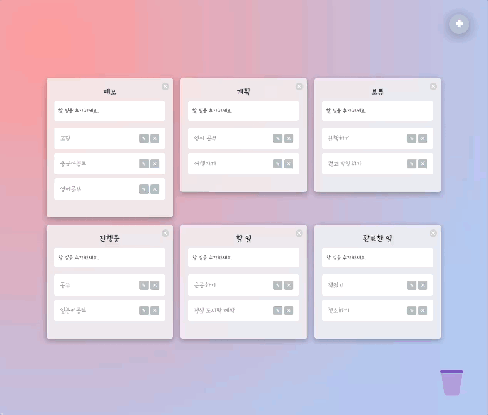
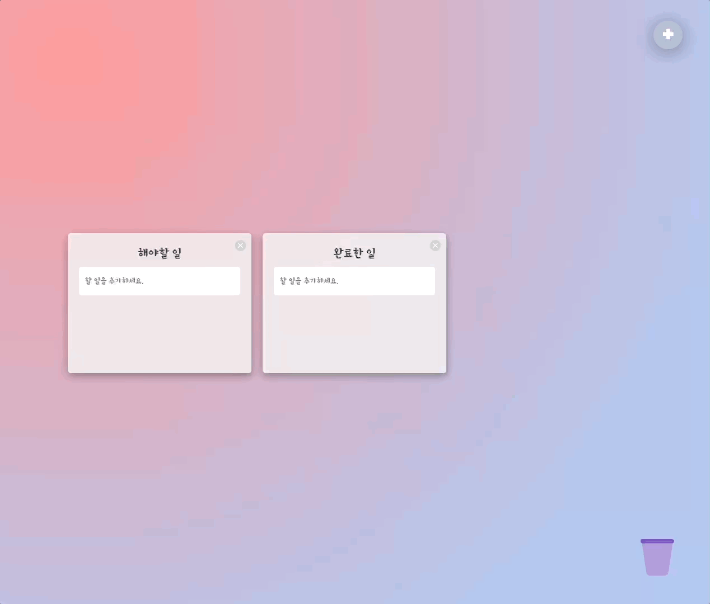
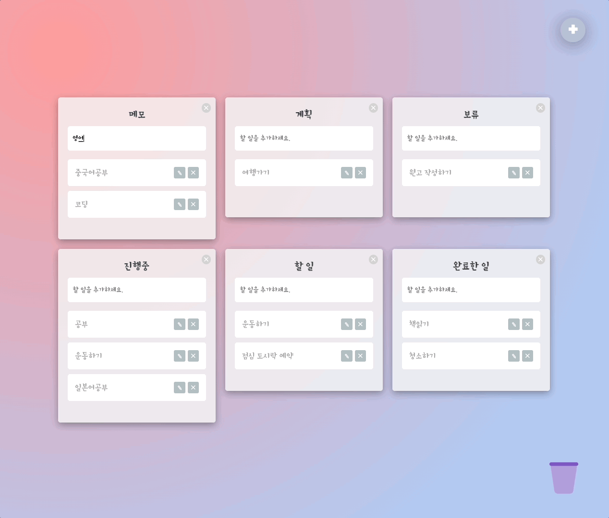
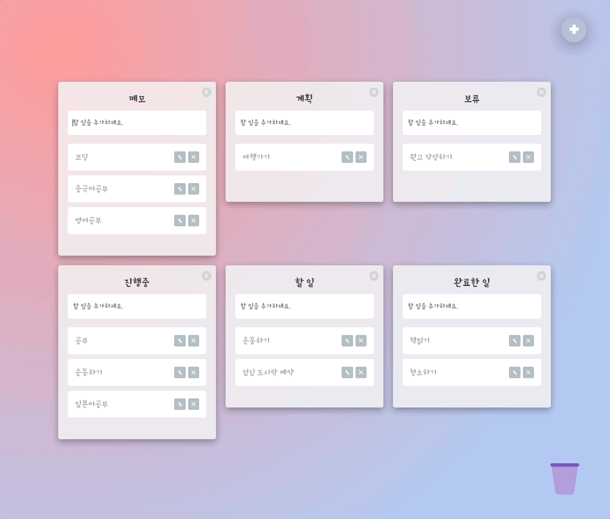

  <a href="https://githubgw.github.io/react-trello">
    
      
    <a display="block" href="https://githubgw.github.io/react-trello">https://githubgw.github.io/react-trello</a>
      
    
  </a>

## Table of contents

- 🔥 [Built with](#built-with)
- 🌈 [Project](#project)
- 📑 [Pages](#pages)
- ⚙ [Features](#features)
- 📝 [License](#license)

## Built with

### Front-end

- `React`
- `Typescript`
- `Recoil`
- `Styled Components`
- `React Beautiful DnD`
- `React Hook Form`

### Deploy

- `GitHub`

## Project

> 1. 보드 추가 및 수정, 삭제

- 새로운 보드를 추가하고, 수정 및 삭제할 수 있습니다.
- 보드 내에서 작성한 할 일을 드래그-앤-드롭을 통해 다른 보드로 이동시킬 수 있습니다.
    
  

> 2. 할 일 추가 및 수정

- Recoil의 atoms와 selectors를 이용해 애플리케이션의 상태를 저장하고 관리합니다.
- 새로운 할 일을 추가하고, 수정할 수 있습니다.
- React Hook Form을 이용해 form의 유효성을 검사합니다.
    
  

> 3. 할 일 드래그 앤 드롭, 할 일 삭제

- React Beautiful DnD를 이용해 드래그-앤-드롭을 구현하였습니다.
- 드래그-앤-드롭을 이용해 작성한 할 일을 삭제할 수 있습니다.
    
  

## Pages

> Root

- 홈

## Features

### 📋 Board

- [x] 보드 추가
- [x] 보드 수정
- [x] 보드 삭제

### 📝 To Do

- [x] 할 일 추가
- [x] 할 일 수정
- [x] 할 일 삭제
- [x] 할 일 드래그 앤 드롭

## License

MIT
